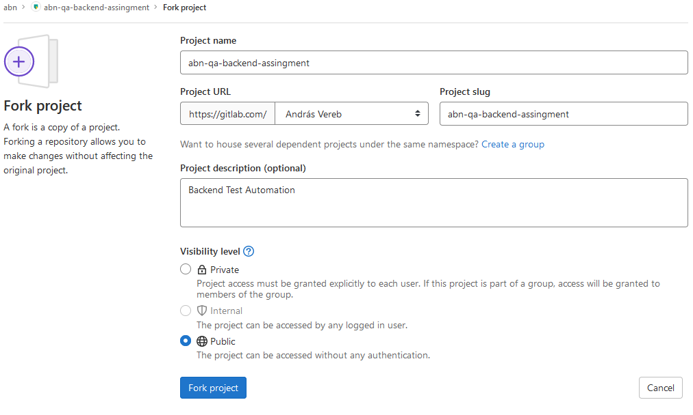
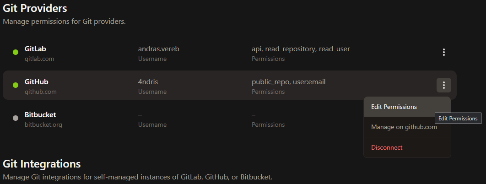
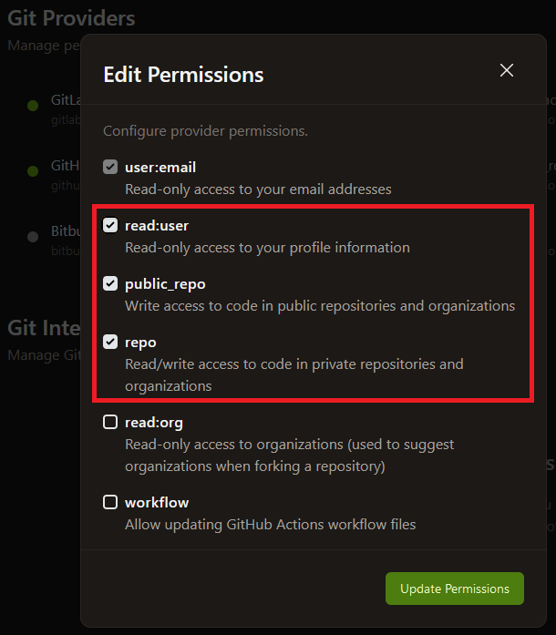

# Backend Test Automation Assignment 

## Requirements
### Environment
* GitHub account
* Java 11 (JDK) (optionally)
* Maven 3.6+ (optionally)
* Any IDE you comfortable with (eg. IntelliJ, VSCode)

### Skills
* Java 8+ (coding standards)
* Clean Code
* Maven
* Git, GitLab, GitHub

### Instructions
Fork this project

Example

   

#### Working in Web IDE (preferable)

1. Open Project in [GitPod](https://gitpod.io/from-referrer/):
2. Sing-in with GitHub account
3. Create and commit your solution into your forked repository
4. Create documentation in the README.md under the `Documentation` section
5. IMPORTANT: Enable Repository permissions (e.g. git push) for GitPod when coding from Web IDE here:
   https://gitpod.io/integrations
   

   
Details here

   Edit permission for GitHub:

   

   
   

## Documentation
_<< Your documentation comes here >>_
